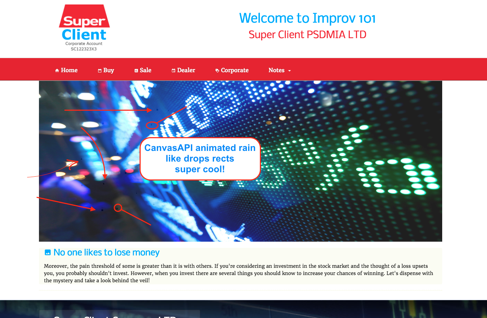
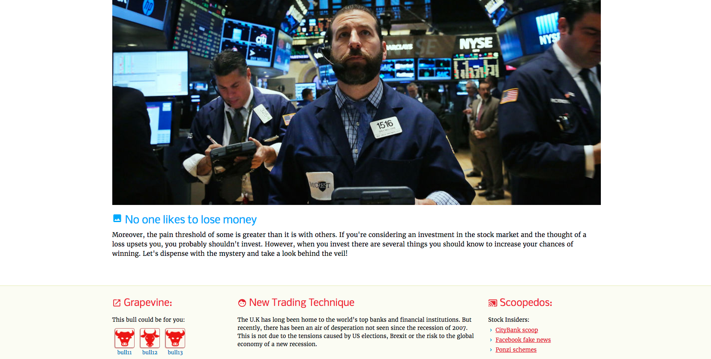

### wflow<kbd>2</kbd> &nbsp; :rocket:

- SPA Using **Bootstrap**, **Sass**, **Npm**, **Bower**, **Grunt**, **Bundler**, **JavaScript** and **Ajax**
  - nanobar library
  
  ### <kbd>To run/install</kbd> :key:
  <kbd>1</kbd> git clone repo :moyai:&nbsp;
  <kbd>2</kbd> npm install :fuelpump:&nbsp;
  <kbd>3</kbd> bower install :izakaya_lantern: &nbsp;
  <kbd>4</kbd> bundler :construction:&nbsp;&nbsp;
  <kbd>5</kbd> type grunt  &nbsp;&nbsp;:checkered_flag:
  
  
  
  

  
   
  
   <kbd>bubble central :droplet:</kbd> now making it interactive whereby user sets number of bubbles, wind, and speed.
   
   
  
  
  
  
  
  
  

  
   
  
   <kbd>roundgosquares file :droplet:</kbd> canvas
   
   
  
  
  
  
  
  
  
  
  
  
  
  
  

  
   
  
  added <kbd>canvas-api-rect :droplet:</kbd> animation to feature image (tiny rain drops over stock mkt)
  
  
  
  
  
  
  
  
   

  
   
  
  top section
  
  

  
  
  
  
  

  
   

  <kbd>github API :droplet:</kbd>
  
  
  
  
  

  
   
  
  <kbd>contact info :droplet:</kbd>
  
  

  

  

 

